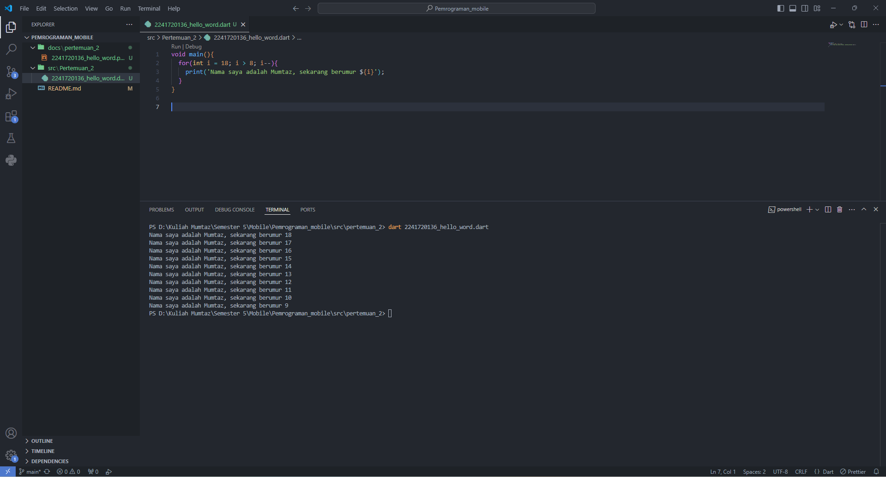

# Pemrograman Mobile

**NIM**: 2241720136  
**Nama**: Ahmad Mumtaz Haris  

## Pertemuan 2

### Soal 1
**Tampilan Screenshot**

---

### Soal 2
**Pertanyaan**: Mengapa sangat penting untuk memahami bahasa pemrograman Dart sebelum kita menggunakan framework Flutter? Jelaskan!

**Jawaban**:  
Sangat penting untuk memahami bahasa pemrograman Dart karena Flutter sepenuhnya menggunakan Dart sebagai bahasa dasarnya. Semua widget, logika aplikasi, dan elemen antarmuka pengguna dalam Flutter ditulis menggunakan Dart. Tanpa pemahaman yang baik tentang dasar-dasar Dart, pengembangan aplikasi menggunakan Flutter akan menjadi lebih sulit dan kurang efektif.

---

### Soal 3
**Pertanyaan**: Rangkumlah materi dari codelab ini menjadi poin-poin penting yang dapat membantu proses pengembangan aplikasi mobile menggunakan framework Flutter.

**Jawaban**:
- Dart diluncurkan pada tahun 2011 dengan fokus awal pada pengembangan web.
- Framework Flutter menggunakan bahasa pemrograman Dart.
- Dart menggabungkan berbagai kelebihan dari banyak bahasa pemrograman, seperti productive tooling, garbage collection, type annotations, statically typed, dan portability.
- Dart dapat dieksekusi dengan dua cara, yaitu melalui virtual machine dan javascript compilation.
- Dart dirancang untuk Object-Oriented Programming (OOP).
- Dart menggunakan function dan method untuk memisahkan kode.
- **Perbedaan function dan method**:
  - Function berada di luar class, seperti Function main.
  - Method terikat pada turunan class dan memiliki referensi implisit ke instance class melalui keyword this.
