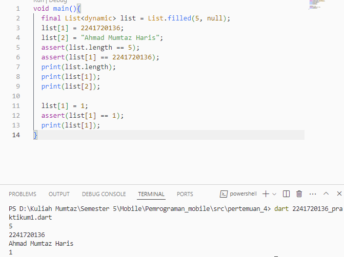
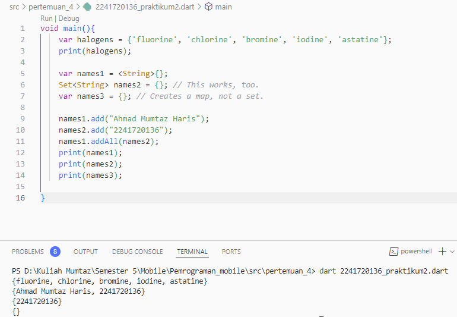
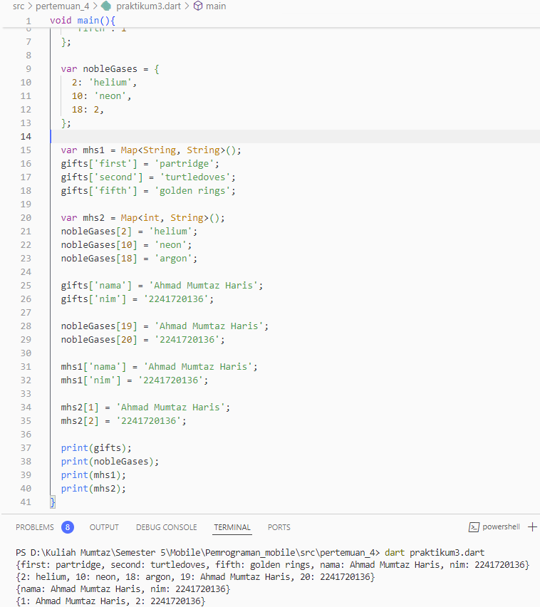
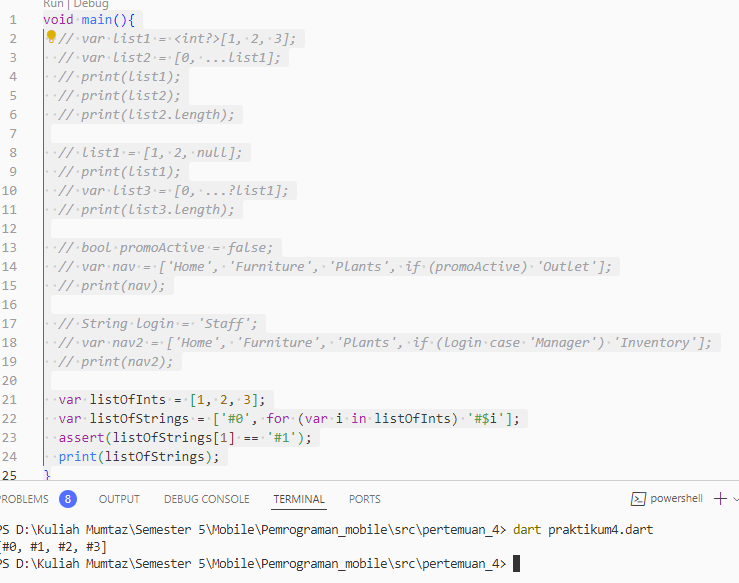
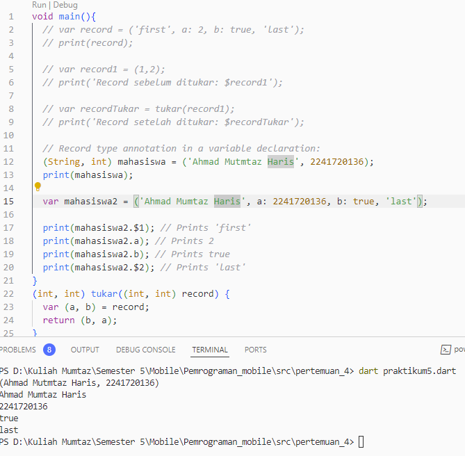

# Pemrograman Mobile

**NIM**: 2241720136  
**Nama**: Ahmad Mumtaz Haris  

## Pertemuan 4

### Praktikum 1
**Tampilan Screenshot**




**Penjelasan**: pembuatan list dengan kapasitas 5 yang diisi dengan null. Setelah mengisi elemen di indeks 1 dan 2 dengan nilai integer dan string, kode ini menggunakan assert untuk memastikan panjang list dan nilai yang diharapkan pada indeks tertentu. Kode kemudian mencetak panjang list dan nilai di indeks 1 dan 2. Setelah itu, elemen di indeks 1 diubah menjadi 1, dan assert digunakan lagi untuk memverifikasi perubahan tersebut sebelum mencetak nilai baru di indeks 1.

---

### Praktikum 2
**Tampilan Sceenshot**


**Penjelasan**: Set bernama halogens dibuat yang berisi nama-nama unsur halogen, dan dicetak. Dua set tambahan, names1 dan names2, didefinisikan untuk menyimpan nama dengan tipe String. Sementara names3 dideklarasikan sebagai map kosong karena tidak ditentukan tipe data. Kemudian, nama "Ahmad Mumtaz Haris" ditambahkan ke names1, dan "2241720136" ditambahkan ke names2. Setelah itu, names1 diperbarui untuk mencakup semua elemen dari names2. Terakhir, semua set dicetak. Hasil dari print(names3) akan mencetak {} karena itu adalah map kosong.

---

### Praktikum 3
**Tampilan Sceenshot**


**Penjelasan**: Penggunaan Map untuk menyimpan pasangan kunci-nilai. Pertama, dua map didefinisikan: gifts, yang berisi kunci string dengan nilai yang beragam, termasuk angka, dan nobleGases, yang menyimpan kunci integer dengan nilai string serta satu angka. Nilai dari kunci 'fifth' dalam gifts diubah menjadi 'golden rings', dan dua entri baru untuk nama dan NIM ditambahkan. Selain itu, map mhs1 dan mhs2 dibuat, di mana mhs1 menggunakan kunci dan nilai bertipe string, sedangkan mhs2 menggunakan kunci integer dengan nilai string. Setelah semua entri ditambahkan, kode mencetak setiap map 

---

### Praktikum 4
**Tampilan Sceenshot**


**Penjelasan**: Kode ini menunjukkan berbagai fitur dalam Dart, termasuk penggunaan list, operator penyebaran, kondisi, dan pengulangan. Pertama, list1 dideklarasikan sebagai list dengan tipe nullable int?, dan list2 diisi dengan elemen 0 diikuti dengan semua elemen dari list1. Setelah mencetak kedua list dan panjang list2, list1 diubah untuk menyertakan nilai null. Kemudian, list3 dibuat dengan menambahkan elemen 0 dan elemen dari list1, tetapi hanya jika tidak ada elemen null. Kode selanjutnya menggunakan boolean promoActive untuk menentukan apakah 'Outlet' ditambahkan ke nav, dan memeriksa apakah login sama dengan 'Manager' untuk menambahkan 'Inventory' ke nav2. Terakhir, kode ini menggunakan perulangan untuk membuat listOfStrings berdasarkan listOfInts dengan format tertentu dan memverifikasi bahwa elemen pada indeks 1 adalah '#1' menggunakan assert.

---

### Praktikum 5
**Tampilan Sceenshot**



**Penjelasan**: Kode ini menunjukkan penggunaan record di Dart, yang memungkinkan pengelompokan beberapa nilai dalam satu entitas. Pertama, sebuah record bernama record dibuat dengan berbagai tipe data, termasuk string, integer, dan boolean. Setelah itu, record record1 yang terdiri dari dua integer didefinisikan, dan nilainya dicetak. Fungsi tukar digunakan untuk menukar posisi dua nilai dalam record1, dan hasilnya dicetak.

Selanjutnya, sebuah variabel bertipe record mahasiswa dideklarasikan dengan tipe yang ditentukan (string dan integer), dan nilainya dicetak. Kemudian, mahasiswa2 dideklarasikan sebagai record dengan nama, integer, boolean, dan string, yang menunjukkan fleksibilitas penggunaan record. Kode ini juga mencetak elemen tertentu dari mahasiswa2 menggunakan sintaks record yang sesuai.

---

### Tugas Praktikum

1. Jelaskan yang dimaksud Functions dalam bahasa Dart!

    Dalam bahasa Dart, fungsi (functions) adalah blok kode yang dapat dieksekusi dan dirancang untuk melakukan tugas tertentu. Fungsi memungkinkan pengembang untuk mengorganisir kode, membuatnya lebih modular dan mudah dibaca. Dengan menggunakan fungsi, kode yang berulang dapat dihindari, dan fungsionalitas tertentu dapat dipisahkan menjadi unit yang terpisah. Fungsi dapat dideklarasikan dengan kata kunci void (jika tidak mengembalikan nilai) atau dengan tipe data tertentu (jika mengembalikan nilai). Fungsi dapat menerima parameter, yang merupakan variabel input. Parameter dapat ditentukan sebagai wajib atau opsional. Fungsi dapat mengembalikan nilai menggunakan kata kunci return. Tipe nilai yang dikembalikan harus sesuai dengan tipe yang ditentukan dalam deklarasi fungsi. Dalam Dart, fungsi diperlakukan sebagai objek. Ini berarti fungsi dapat disimpan dalam variabel, dilewatkan sebagai argumen ke fungsi lain, atau dikembalikan dari fungsi lain Dart juga mendukung fungsi anonim (fungsi tanpa nama) dan fungsi lambda (fungsi panah) untuk penulisan yang lebih ringkas. Fungsi yang menerima fungsi lain sebagai argumen atau mengembalikan fungsi sebagai hasilnya disebut fungsi tingkat tinggi. Ini memungkinkan penggunaan fungsi sebagai parameter dan pengembalian, sehingga meningkatkan fleksibilitas dalam pengembangan aplikasi.
2. Jenis jenis parameter
    
    - Parameter Posisi (Positional Parameters) Parameter ini adalah parameter standar yang harus diberikan dalam urutan yang ditentukan saat memanggil fungsi.

        ```Dart
        void greet(String name, int age) {
            print('Hello, $name. You are $age years old.');
        }
        void main() {
            greet('Ahmad', 20); // Memanggil fungsi dengan parameter posisi
        }
        ```
   - Parameter Opsional (Optional Parameters) Parameter opsional memungkinkan pemanggilan fungsi tanpa harus memberikan nilai untuk semua parameter. Ada dua cara untuk mendefinisikan parameter opsional: menggunakan kurung kotak [] untuk parameter posisi opsional, atau menggunakan tanda kurung kurawal {} untuk parameter bernama.
        ```Dart
        //parameter posisi opsional
        void greet(String name, [int age]) {
            if (age != null) {
                print('Hello, $name. You are $age years old.');
            } else {
                print('Hello, $name.');
            }
        }

        void main() {
            greet('Ahmad');        // Hanya memberikan nama
            greet('Ahmad', 20);   // Memberikan nama dan umur
        }
        ```
        ```Dart
        //Parameter bernama
        void greet({required String name, int age = 0}) {
            print('Hello, $name. You are $age years old.');
        }

        void main() {
            greet(name: 'Ahmad'); // Hanya memberikan nama
            greet(name: 'Ahmad', age: 20); // Memberikan nama dan umur
        }
        ```
    - Parameter Default Parameter ini memiliki nilai default yang digunakan jika argumen tidak diberikan saat fungsi dipanggil.
        ```Dart
        void greet(String name, [int age = 18]) {
            print('Hello, $name. You are $age years old.');
        }

        void main() {
            greet('Ahmad'); // Menggunakan nilai default untuk age
            greet('Ahmad', 20); // Memberikan umur spesifik
        }
        ```
    - Parameter Variadic Dart juga mendukung parameter variadic, yang memungkinkan fungsi untuk menerima sejumlah argumen yang tidak ditentukan. Ini dilakukan dengan menggunakan List.
        ```Dart
        void printNumbers(int a, int b, [int c, int d]) {
            print('Numbers: $a, $b, ${c ?? 'N/A'}, ${d ?? 'N/A'}');
        }

        void main() {
            printNumbers(1, 2);         // Memanggil dengan dua parameter
            printNumbers(1, 2, 3);      // Memanggil dengan tiga parameter
            printNumbers(1, 2, 3, 4);   // Memanggil dengan empat parameter
        }
        ```
    - Parameter Bermodul Dart memungkinkan penggunaan parameter dengan anotasi required untuk menandakan bahwa parameter tersebut wajib disediakan ketika memanggil fungsi, terutama saat menggunakan parameter bernama.
        ```Dart
        void greet({required String name, required int age}) {
            print('Hello, $name. You are $age years old.');
        }

        void main() {
            greet(name: 'Ahmad', age: 20); // Memanggil fungsi dengan semua parameter wajib
        }
        ```
3. Dalam Dart, functions sebagai first-class objects berarti fungsi dapat diperlakukan seperti objek lainnya. Fungsi dapat disimpan dalam variabel, dilewatkan sebagai argumen ke fungsi lain, atau dikembalikan dari fungsi lain. Dart memperlakukan fungsi sebagai entitas yang memiliki nilai, seperti string atau integer, dan dapat dimanipulasi secara fleksibel. Maksud Functions  sebagai First-Class Objects
    - Disimpan dalam variabel – Fungsi dapat disimpan dalam variabel, memungkinkan kita untuk memanggilnya melalui variabel tersebut.
    - Dilewatkan sebagai argumen – Fungsi dapat diberikan sebagai argumen ke fungsi lain.
    - Dikembalikan dari fungsi lain – Sebuah fungsi dapat mengembalikan fungsi lain sebagai hasilnya.
        ```Dart
        //Menyimpan fungsi dalam variabel

        void sayHello() {
            print('Hello!');
        }

        void main() {
            // Menyimpan fungsi sayHello ke dalam variabel
            var greeting = sayHello;
            greeting();  // Memanggil fungsi melalui variabel
        }
        ```
        ```Dart
        //Melewatkan fungsi sebagai argument
        void printResult(int Function(int, int) operation, int a, int b) {
            print(operation(a, b));
        }

        int add(int x, int y) => x + y;

        void main() {
            // Melewatkan fungsi add sebagai argumen
            printResult(add, 3, 4);  // Output: 7
        }
        ```
        ```Dart
        //Mengembalikan fungsi dari fungsi lain

        Function multiplyBy(int multiplier) {
            return (int value) => value * multiplier;
        }

        void main() {
            var timesTwo = multiplyBy(2);
            print(timesTwo(4));  // Output: 8

            var timesThree = multiplyBy(3);
            print(timesThree(4));  // Output: 12
        }
        ```
4. Anonymous functions (atau fungsi anonim) adalah fungsi yang tidak memiliki nama. Dalam Dart, anonymous functions sering digunakan ketika kita hanya memerlukan fungsi satu kali atau fungsi kecil yang tidak perlu didefinisikan secara terpisah. Anonymous functions sangat umum digunakan dalam operasi seperti iterasi, pemrosesan data, atau sebagai callback.
    ```Dart
    //Anonymous Functions dengan Blok Kode
    (var1, var2) {
        // Blok kode
        return var1 + var2;
    };
    ```
    ```Dart
    //Anonymous Functions dengan Arrow Syntax
    (var1, var2) => var1 + var2;
    ```
    Contoh Penggunaan anonymous function
    ```Dart
    //Menggunakan Anonymous Function dalam Iterasi
    void main() {
        var list = [1, 2, 3, 4];
        
        // Anonymous function di dalam forEach
        list.forEach((item) {
            print('Item: $item');
        });
    }
    ```
    ```Dart
    //Menyimpan Anonymous Function dalam Variabel
    void main() {
        var multiply = (int a, int b) {
            return a * b;
        };
        
        print(multiply(3, 4));  // Output: 12
    }
    ```
    ```Dart
    //Menggunakan Anonymous Function sebagai Parameter
    void performOperation(int Function(int, int) operation, int a, int b) {
        print(operation(a, b));
    }

    void main() {
        performOperation((x, y) => x + y, 5, 3);  // Output: 8
    }

    ```
5. Lexical scope mengacu pada cara bahasa pemrograman menentukan ruang lingkup variabel berdasarkan lokasi fisik di kode sumber. Dengan kata lain, Lexical Scope berarti bahwa variabel-variabel yang dapat diakses dalam sebuah fungsi ditentukan oleh posisi fungsi tersebut dalam kode (pada saat penulisan). Variabel hanya dapat diakses jika dideklarasikan di dalam scope yang sesuai. Contohnya:
    ```Dart
    void main() {
        int x = 10;  // Lexical scope dari variabel x adalah main()

        void innerFunction() {
            print(x);  // Mengakses x dari scope luar (main)
        }

        innerFunction();  // Output: 10
    }

    ```
    Lexical closure adalah fungsi yang "menangkap" variabel dari lingkungan tempat fungsi tersebut didefinisikan, bahkan setelah lingkungan tersebut tidak ada lagi (fungsi luar selesai dieksekusi). Closures memungkinkan fungsi untuk "mengingat" dan menggunakan variabel dari scope luar meskipun fungsi luar tersebut sudah tidak lagi aktif. Closure terjadi ketika sebuah fungsi dideklarasikan di dalam fungsi lain dan fungsi dalam tersebut "mengunci" atau "menangkap" variabel dari scope luar untuk digunakan di kemudian waktu. Contoh:
    ```Dart
    Function makeAdder(int addBy) {
        return (int i) => i + addBy;  // Fungsi yang mengembalikan closure
    }

    void main() {
        var addByTwo = makeAdder(2);  // Closure menangkap nilai addBy = 2
        var addByFive = makeAdder(5); // Closure menangkap nilai addBy = 5

        print(addByTwo(3));  // Output: 5 (3 + 2)
        print(addByFive(3)); // Output: 8 (3 + 5)
    }
    ```
6. Di Dart, fungsi tidak mendukung secara langsung pengembalian beberapa nilai seperti beberapa bahasa lain yang mendukung fitur ini secara langsung. Namun, ada beberapa cara untuk membuat sebuah fungsi mengembalikan lebih dari satu nilai, seperti dengan menggunakan tuples (record types), list, atau map.
    - Menggunakan list
        ```Dart
        List<int> getCoordinates() {
            return [10, 20];
        }

        void main() {
            var coordinates = getCoordinates();
            print('x: ${coordinates[0]}, y: ${coordinates[1]}');
        }
        ```
    - Menggunakan map
        ```Dart
        Map<String, dynamic> getPerson() {
            return {
                'name': 'Ahmad',
                'age': 22,
            };
        }

        void main() {
            var person = getPerson();
            print('Name: ${person['name']}, Age: ${person['age']}');
        }
        ```
    - Menggunakan tuples
        ```Dart
        (String, int) getPersonInfo() {
            return ('Ahmad Mumtaz Haris', 2241720136);
        }

        void main() {
            var personInfo = getPersonInfo();
            print('Name: ${personInfo.$1}, NIM: ${personInfo.$2}');
        }
        ```
    - Menggunakan kelas
        ```Dart
        class Person {
            String name;
            int age;
            
            Person(this.name, this.age);
        }

        Person getPersonDetails() {
            return Person('Ahmad', 22);
        }

        void main() {
            var person = getPersonDetails();
            print('Name: ${person.name}, Age: ${person.age}');
        }
        ```
---