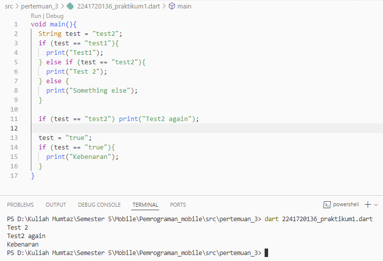
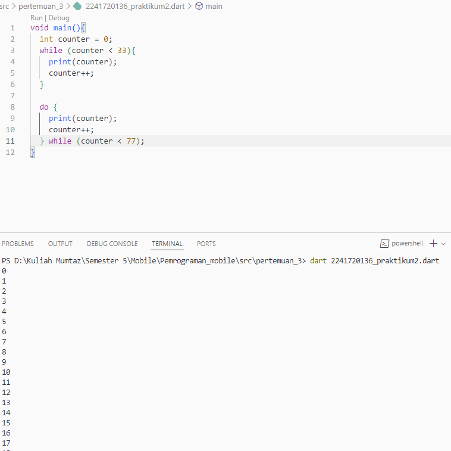
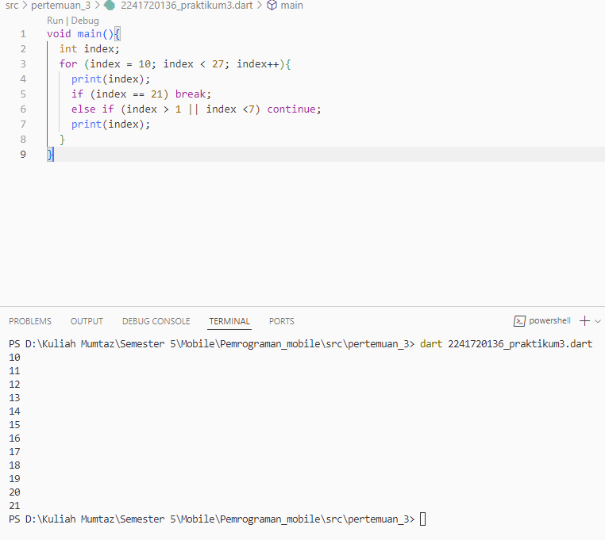
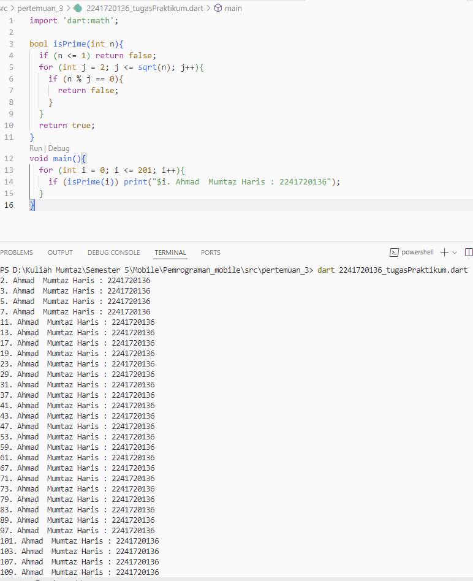

# Pemrograman Mobile

**NIM**: 2241720136  
**Nama**: Ahmad Mumtaz Haris  

## Pertemuan 3

### Praktikum 1
**Tampilan Screenshot**

**Penjelasan**: Kode tersebut adalah contoh penggunaan if else, dimana sebuah variabel akan dicoba kedalam sebuah kondisi, jika kondisi terpenuhi, maka kode yang ada didalamnya akan dijalankan. Contohnya adalah test == "test1", karena variabel test bernilai "test1" maka kode print("test1") akan dijalankan.

---

### Praktikum 2
**Tampilan Sceenshot**

**Penjelasan**: Kode tersebut adalah contoh penggunaan loop while dan do-while, while akan menjalankan kode didalmnya hanya jika kondisi terpenuhi, sedangkan do-while akan menjalankan kode didalmnya setidaknya satu kali meskipun kondisi tidak terpenuhi, karena kode ditulis sebelum kondisi(while). 

---

### Praktikum 3
**Tampilan Sceenshot**

**Penjelasan**: Merupakan contoh penggunaan loop for yang hampir sama dengan while.

---

### Tugas Praktikum
**Tampilan Sceenshot**

**Penjelasan**: Saya melakukan perulangan menggunakan for. Untuk mencari bilangan prima, saya menggunakan method isPrime yang menerima parameter n yaitu bilangan yang akan diperiksa apakah merupakan bilangan prima atau bukan. Pemeriksaan bilangan prima dilakukan dengan memriksa apakah n <= 1, jika iya makan n bukan bilangan prima. Pemeriksaan kedua dilakukan dengan looping dimulai dari 2 hinggan akar kuadrat n kemudian dilakukan operasi mod, jika menghasilkan 0 (habis dibagi) maka bukan prima. Jika lolos dari semua pemeriksaan diatas maka bilangan tersebut adalah bilangan prima.

---